# ALPM

This project comprises specifications, as well as [Rust] libraries and tools for **A**rch **L**inux **P**ackage **M**anagement.

The ALPM project arose from the need for more clearly specifying the interfaces, as well as providing bindings and tools in a memory-safe programming language.
The specifications and implementations are based on ad-hoc implementations in the [pacman] project.
Currently, this project aims to maintain compatibility with [pacman] `5.1.0` and onwards.

The scope of this project is to provide robust integration for all relevant package creation and consumption, as well as repository management tasks.
As such, the ALPM project also aims at providing drop-in replacements or alternatives for some facilities provided by [pacman].

This project is currently supported by the [Sovereign Tech Agency].
Read the [official announcement] for more information.

## Documentation

The latest project documentation can be found at <https://alpm.archlinux.page>

## Overview

The following mindmap attempts to provide a high-level overview of the project and put file types as well as (existing and upcoming) libraries into context.

```mermaid
mindmap
  root((ALPM))
    📂 Source
      📄 PKGBUILD
      📄 .SRCINFO
      📚️ alpm-srcinfo*
    📦 Package
      📄 .BUILDINFO
      📄 .PKGINFO
      📄 .INSTALL
      📄 .MTREE
      📚️ alpm-buildinfo
      📚️ alpm-pkginfo*
      📚️ alpm-mtree*
      📚️ alpm-package*
      📚️ alpm-package-verify*
      📚️ alpm-package-verify-vda*
    🗄️ Repository
      📄 desc
      📄 files
      📚️ alpm-repo*
      📚️ alpm-repo-desc*
      📚️ alpm-repo-files*
    🗄️ Package Management
      📄 desc
      📄 files
      📚️ alpm-db*
      📚️ alpm-db-desc*
      📚️ alpm-db-download*
      📚️ alpm-db-files*
      📚️ alpm-db-verify*
      📚️ alpm-db-verify-vda*
```

For an overview of planned specifications and components, refer to the [milestones] of the project.

[*] Not yet implemented, or subject to change.

## Components

Currently the following components are available:

- [alpm-mtree]: a library and commandline interface to work with `.MTREE` and `mtree` files
- [alpm-buildinfo]: a library and commandline interface to work with `BUILDINFO` files
- [alpm-parsers]: a library for providing various custom parsers/deserializers for file types used in ALPM
- [alpm-pkginfo]: a library and commandline interface to work with `.PKGINFO` files
- [alpm-types]: a central library for types used by other ALPM libraries and tools

## Contributing

Please refer to the [contribution guidelines] to learn how to contribute to this project.

## License

This project can be used under the terms of the [Apache-2.0] or [MIT].
Contributions to this project, unless noted otherwise, are automatically licensed under the terms of both of those licenses.

[Apache-2.0]: LICENSES/Apache-2.0.txt
[MIT]: LICENSES/MIT.txt
[Rust]: https://www.rust-lang.org/
[alpm-buildinfo]: alpm-buildinfo/
[alpm-mtree]: alpm-mtree/
[alpm-parsers]: alpm-parsers/
[alpm-pkginfo]: alpm-pkginfo/
[alpm-types]: alpm-types/
[components]: #components
[contribution guidelines]: CONTRIBUTING.md
[milestones]: https://gitlab.archlinux.org/archlinux/alpm/alpm/-/milestones
[pacman]: https://gitlab.archlinux.org/pacman/pacman
[Sovereign Tech Agency]: https://www.sovereign.tech/tech/arch-linux-package-management
[official announcement]: https://lists.archlinux.org/archives/list/arch-dev-public@lists.archlinux.org/thread/MZLH43574GGP7QQ7RKAAIRFT5LJPCEB4/
