# ALPM

This project comprises specifications, as well as [Rust] libraries and tools for **A**rch **L**inux **P**ackage **M**anagement.

The ALPM project arose from the need for more clearly specifying the interfaces, as well as providing bindings and tools in a memory-safe programming language.
The specifications and implementations are based on ad-hoc implementations in the [pacman] project.
Currently, this project aims to maintain compatibility with [pacman] `5.1.0` and onwards.

The scope of this project is to provide robust integration for all relevant package creation and consumption, as well as repository management tasks.
As such, the ALPM project also aims at providing drop-in replacements or alternatives for some facilities provided by [pacman].

This project has been financed by the [Sovereign Tech Agency].
Read the [official announcement] for more information.

## Documentation

The latest project documentation can be found at <https://alpm.archlinux.page>

Documentation for all current ALPM lints is available at <https://alpm.archlinux.page/lints/>

## Overview

The following mindmap attempts to provide a high-level overview of the project and put file types as well as (existing and upcoming) libraries into context.

```mermaid
mindmap
  root((ALPM))
    📂 Source
      📄 PKGBUILD
      📄 .SRCINFO
      📚️ alpm-pkgbuild
      ⌨️/📚️ alpm-srcinfo
    📦 Package
      📄 .BUILDINFO
      📄 .INSTALL
      📄 .MTREE
      📄 .PKGINFO
      ⌨️/📚️ alpm-buildinfo
      ⌨️/📚️ alpm-mtree
      📚️ alpm-package
      ⌨️/📚️ alpm-pkginfo
      ⌨️/📚️ alpm-soname
    🗄️ Repository
      📄 desc
      📄 files
      ⌨️/📚️ alpm-repo-db
    🗄️ Package Management
      📄 desc
      📄 files
      ⌨️/📚️ alpm-db
    ✅️ Linting
      ⌨️/📚️ alpm-lint
    💬 Language bindings
      🐍 python-alpm
    🛠️ Utils
      📚️ alpm-common
      📚️ alpm-compress
      📚️ alpm-parsers
```

For an overview of planned specifications and components, refer to the [milestones] of the project.

## Components

Currently the following software components are available:

- [alpm-buildinfo]: a library and command line interface to work with [BUILDINFO(5)] files
- [alpm-common]: a library for common traits and functionality
- [alpm-compress]: a library for compression operations in ALPM
- [alpm-db]: a library and command line interface to work with an [alpm-db(7)] and its [alpm-db-desc(5)] and [alpm-db-files(5)] file formats
- [alpm-lint]: a linting tool for everything around Arch Linux packaging.
- [alpm-mtree]: a library and command line interface to work with [ALPM-MTREE(5)] files
- [alpm-package]: a library for the creation of [alpm-package(7)] files
- [alpm-parsers]: a library for providing various custom parsers/deserializers for file types used in ALPM
- [alpm-pkginfo]: a library and command line interface to work with [PKGINFO(5)] files
- [alpm-repo-db]: a library and command line interface to work with an [alpm-repo-db(7)] and its [alpm-repo-desc(5)] and [alpm-repo-files(5)] file formats
- [alpm-soname]: a library and command line interface for looking up soname data
- [alpm-srcinfo]: a library and command line interface to work with [SRCINFO(5)] files
- [alpm-types]: a central library for types used by other ALPM libraries and tools
- [python-alpm]: Python bindings for ALPM crates and the python-alpm Python library

## Contributing

Please refer to the [contribution guidelines] to learn how to contribute to this project.

## Releases

Releases of [components] are created by the developers of this project.

[OpenPGP certificates] with the following [OpenPGP fingerprints] can be used to verify signed tags:

- [`3051329B47B855C4F888F975CC9408F679023B65`] ([Arne Christian Beer] &lt;<nukesor@archlinux.org>&gt;)
- [`991F6E3F0765CF6295888586139B09DA5BF0D338`] ([David Runge] &lt;<dvzrv@archlinux.org>&gt;)
- [`165E0FF7C48C226E1EC363A7F83424824B3E4B90`] ([Orhun Parmaksız] &lt;<orhun@archlinux.org>&gt;)

Some of the above are part of [archlinux-keyring] and certified by at least three [main signing keys] of the distribution.

## License

This project can be used under the terms of the [Apache-2.0] or [MIT].
Contributions to this project, unless noted otherwise, are automatically licensed under the terms of both of those licenses.

[ALPM-MTREE(5)]: https://alpm.archlinux.page/specifications/ALPM-MTREE.5.html
[Apache-2.0]: LICENSES/Apache-2.0.txt
[Arne Christian Beer]: https://archlinux.org/people/support-staff/#nukesor
[BUILDINFO(5)]: https://alpm.archlinux.page/specifications/BUILDINFO.5.html
[David Runge]: https://archlinux.org/people/developers/#dvzrv
[MIT]: LICENSES/MIT.txt
[OpenPGP certificates]: https://openpgp.dev/book/certificates.html
[OpenPGP fingerprints]: https://openpgp.dev/book/certificates.html#fingerprint
[Orhun Parmaksız]: https://archlinux.org/people/package-maintainer/#orhun
[PKGINFO(5)]: https://alpm.archlinux.page/specifications/PKGINFO.5.html
[Rust]: https://www.rust-lang.org/
[SRCINFO(5)]: https://alpm.archlinux.page/specifications/SRCINFO.5.html
[Sovereign Tech Agency]: https://www.sovereign.tech/tech/arch-linux-package-management
[`165E0FF7C48C226E1EC363A7F83424824B3E4B90`]: https://pgpkeys.eu/pks/lookup?search=165E0FF7C48C226E1EC363A7F83424824B3E4B90&fingerprint=on&op=index
[`3051329B47B855C4F888F975CC9408F679023B65`]: https://pgpkeys.eu/pks/lookup?search=3051329B47B855C4F888F975CC9408F679023B65&fingerprint=on&op=index
[`991F6E3F0765CF6295888586139B09DA5BF0D338`]: https://pgpkeys.eu/pks/lookup?search=991F6E3F0765CF6295888586139B09DA5BF0D338&fingerprint=on&op=index
[alpm-buildinfo]: alpm-buildinfo/
[alpm-common]: alpm-common/
[alpm-compress]: alpm-compress/
[alpm-db(7)]: https://alpm.archlinux.page/specifications/alpm-db.7.html
[alpm-db-desc(5)]: https://alpm.archlinux.page/specifications/alpm-db-desc.5.html
[alpm-db-files(5)]: https://alpm.archlinux.page/specifications/alpm-db-files.5.html
[alpm-db]: alpm-db/
[alpm-lint]: alpm-lint/
[alpm-mtree]: alpm-mtree/
[alpm-package(7)]: https://alpm.archlinux.page/specifications/alpm-package.7.html
[alpm-package]: alpm-package/
[alpm-parsers]: alpm-parsers/
[alpm-pkginfo]: alpm-pkginfo/
[alpm-repo-db(7)]: https://alpm.archlinux.page/specifications/alpm-repo-db.7.html
[alpm-repo-db]: alpm-repo-db/
[alpm-repo-desc(5)]: https://alpm.archlinux.page/specifications/alpm-repo-desc.5.html
[alpm-repo-files(5)]: https://alpm.archlinux.page/specifications/alpm-repo-files.5.html
[alpm-soname]: alpm-srcinfo/
[alpm-srcinfo]: alpm-srcinfo/
[alpm-types]: alpm-types/
[archlinux-keyring]: https://gitlab.archlinux.org/archlinux/archlinux-keyring
[components]: #components
[contribution guidelines]: CONTRIBUTING.md
[main signing keys]: https://archlinux.org/master-keys/
[milestones]: https://gitlab.archlinux.org/archlinux/alpm/alpm/-/milestones
[official announcement]: https://lists.archlinux.org/archives/list/arch-dev-public@lists.archlinux.org/thread/MZLH43574GGP7QQ7RKAAIRFT5LJPCEB4/
[pacman]: https://gitlab.archlinux.org/pacman/pacman
[python-alpm]: python-alpm/
