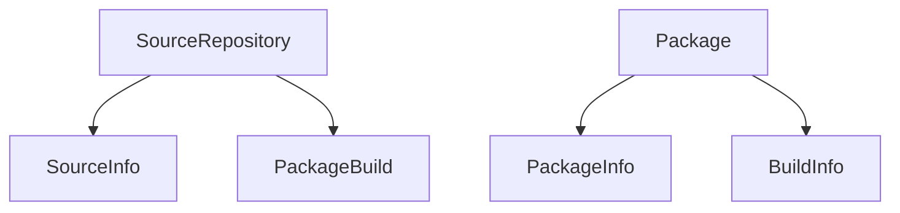

# Architecture guide for `alpm-lint`

The `alpm-lint` project is a linting system designed to handle all **A**rch **L**inux **P**ackage **M**anagement (ALPM) related files, artifacts and environments.
This document explains the framework's architecture, how its components interact, and provides a detailed walkthrough of the linting pipeline.

## Overview

The framework follows a fairly modular design that cleanly separates concerns. Its main tasks include:

1. _Scope Detection_ - Automatic detection of what type of files/data to lint based on a provided path.
1. _Resource Gathering_ - Parsing and loading of relevant data files for the respective detected scope.
1. _Lint Rule Selection_ - Selecting of lint rules from a global set based on scope, CLI options and configuration.
1. _Execution_ - Running of selected lints and collecting of encountered issues.
1. _Output_ - Formatting and display of results.

Additionally, `alpm-lint` provides first class support for external tool integration by providing structured data output for pretty much everything, including:

- Lint rule specifications
- Meta identifiers (groups, scopes, level)
- Configuration option specifications 
- Issues found during linting

## Linting pipeline walkthrough

The [`alpm-lint::commands::check`] function is a good example of how a complete linting pipeline looks like.
The following gives you a rough walkthrough.
The specific types and functions are explained in more detail in the following section.

1. Get either the provided path or fallback to the current working directory.
    ```rust
    let path = match path {
        Some(path) => path,
        None => current_dir()?,
    };
    ```
1. Determine the scope based on that path.
   Fail if none of the expected files for the scope can be found.
    ```rust
    let scope = match scope {
        Some(scope) => scope,
        None => LintScope::detect(&path)?,
    };
    ```
1. Load the actual data from disk, based on the path and scope.
    ```rust
    let resources = Resources::gather(&path, scope)?;
    ```
1. Initialize and configure all lints via the [`LintStore`].
   Then get all lints that match the [`LintConfiguration`] and the current scope.
    ```rust
    let store = LintStore::new(config);
    let lint_rules = store.filtered_lint_rules(&scope);
    ```
1. Run the applicable lint rules one by one and aggregate any detected issues in a vector.
    ```rust
    let mut issues = Vec::new();
    for (name, rule) in lint_rules {
        rule.run(&resources, &mut issues)?;
    }
    ```

## Core Components

### Lint Scopes

The [`LintScope`] enum defines the context in which lint rules operate.
It has a hierarchical structure in the sense that "higher" scopes cover multiple "lower" scopes.



The [`LintScope::detect`] function takes care of determining the current scope, based on a given path and the files that are found at this path.
Check the [`LintScope`] documentation for all scope variants and their use cases.

### Resources

The [`Resources`] enum handles collection of file data for a given scope, so that lint logic can be executed on that data.

As it contains data for a respective scope, it has the same variants as [`LintScope`].
However, each of its variants is structural.

The [`Resources::gather`] function is responsible for gathering all necessary data for a given scope and path.

### [`LintRule`] trait

All lint rules implement the [`LintRule`] trait.
This allows the [`LintStore`] to handle all lint rules generically via that trait interface.

For detail, take a look at the [`LintRule`] trait's documentation, but the most important things exposed by the trait are:

- `name`: A name that must be unique in a given scope! This is also ensured via tests.
- `scope`: The [lint scope](#lint-scope) in which that lint rule operates. E.g. it may apply to a `.SRCINFO` or check consistency between files in a source repository.
- `level`: The severity level of a lint rule. Whether it's considered a severe error, a warning or a mere suggestion.
- `groups`: The [lint groups](#lint-group) the lint rule is assigned to.
- `configuration_options`: Any config options that can be used to tweak this lint rule's behavior.

There're more functions on this trait, check out the official information if you're interested!

To see how a specific [`LintRule`] implementation would look like, check out the [CONTRIBUTING.md](../CONTRIBUTING.md) document or take a peek at some "simpler" rules such as the [`source_info::duplicate_architecture`] lint.

There is also an example lint rule template in [`alpm-lint/examples/my_new_lint.rs`].

### Lint Store

The [`LintStore`] acts as the registry and factory for all lint rules:

**NOTE**: New lint rules have to be manually added to the [`LintStore::register`] function, otherwise they will not be made available.

The [`LintStore`] provides two important functions:

- [`LintStore::filtered_lint_rules`]: This returns the [`FilteredLintRules`] iterator that applies all configuration and scope-based filtering of the lint rules.
  It is used in every linting run to get the exact set of lint rules that is relevant for the current task at hand.
- [`LintStore::serializable_lint_rules`]: This iterates over all lint rules and creates a [`SerializableLintRule`] for each of them.
  This data is consumed in the [`alpm-lint-website`] and allows for statically generating the website with all available rules.

### Configuration System

The configuration structs and enums are contained in the [`alpm-lint-config`] crate.

The whole configuration system is split across two main types, [`LintConfiguration`] and [`LintRuleConfiguration`].

- [`LintConfiguration`] is used to enable and disable lints or groups of lints.
- [`LintRuleConfiguration`] is used to change how certain lint rules behave.
  Each [`LintRule`] is passed this configuration during initialization and can pick whatever options they require.
  If a [`LintRule`] uses an option, it must expose that option via [`LintRule::configuration_options`], for the option to show up in the central documentation.

The [`LintRuleConfiguration`] is a bit special, as it is created via the [`create_lint_rule_config`] macro.
This macro allows us to consistently implement several things and maintain the following assumptions for the generated code:

- The actual [`LintRuleConfiguration`] struct with all of its fields and a `Default` implementation.
- Structured data output of all options and their documentation via [`LintRuleConfiguration::configuration_options`] for consumption by the [`alpm-lint-website`].
- The [`LintRuleConfigurationOptionName`] enum, which allows lint rules to back-reference options they use.

#### Lint group

The [`LintGroup`] enum defines categories such as `Pedantic` and `Testing`:

Lint rules are enabled by default **unless** they are assigned to specific groups.
Users may choose to specifically select these groups of lints or individual lints to be run.

For example, some lints are prone to trigger on false-positives or are still being tested for wider adoption.
For that reason, these "pedantic" or "testing" lints are not enabled by default and assigned to the respective group.

#### Severity level

The [`Level`] is used to categorize the severity of a detected LintRule violation.

Check the Rust documentation to see the various levels and their meaning.

## Mission statement

The goal of `alpm-lint` is to enable Arch Linux developers to easily and ergonomically build highly encapsulated and configurable lint rules.
At the same time, all lint rules must be well-documented and this documentation must be easily accessible to all people that encounter issues using lints.
This project must be structured in a modular way to allow quick addition of new rules, scopes, options, groups, etc.

Users of the linter should get well-formatted and expressive error messages, at best even with explicit proposals on how to fix a specific issue.

[`alpm-lint-website`]: https://alpm.archlinux.page/lints/index.html
[`alpm-lint-config`]: https://alpm.archlinux.page/rustdoc/alpm_lint_config/index.html
[`alpm-lint/examples/my_new_lint.rs`]: https://gitlab.archlinux.org/archlinux/alpm/alpm/-/blob/main/alpm-lint/examples/my_new_lint.rs
[`alpm-lint::commands::check`]: https://gitlab.archlinux.org/archlinux/alpm/alpm/-/blob/main/alpm-lint/src/commands.rs
[`source_info::duplicate_architecture`]: https://alpm.archlinux.page/rustdoc/alpm_lint/lint_rules/source_info/duplicate_architecture/struct.DuplicateArchitecture.html
[`linting_config`]: https://alpm.archlinux.page/rustdoc/alpm_lint_config/macro.linting_config.html
[`FilteredLintRules`]: https://alpm.archlinux.page/rustdoc/alpm_lint/lint_rules/store/struct.FilteredLintRules.html
[`Level`]: https://alpm.archlinux.page/rustdoc/alpm_lint/enum.Level.html
[`LintConfiguration`]: https://alpm.archlinux.page/rustdoc/alpm_lint_config/struct.LintConfiguration.html
[`LintGroup`]: https://alpm.archlinux.page/rustdoc/alpm_lint_config/enum.LintGroup.html
[`LintIssue`]: https://alpm.archlinux.page/rustdoc/alpm_lint/issue/struct.LintIssue.html
[`LintRule`]: https://alpm.archlinux.page/rustdoc/alpm_lint/trait.LintRule.html
[`LintRuleConfiguration`]: https://alpm.archlinux.page/rustdoc/alpm_lint_config/struct.LintRuleConfiguration.html
[`LintRuleConfigurationOptionName`]: https://alpm.archlinux.page/rustdoc/alpm_lint_config/enum.LintRuleConfigurationOptionName.html
[`LintScope`]: https://alpm.archlinux.page/rustdoc/alpm_lint/scope/enum.LintScope.html
[`LintStore`]: https://alpm.archlinux.page/rustdoc/alpm_lint/lint_rules/store/struct.LintStore.html
[`Resources`]: https://alpm.archlinux.page/rustdoc/alpm_lint/resources/enum.Resources.html

