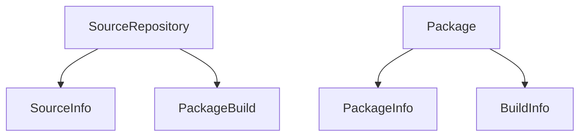

# Architecture Guide for alpm-lint

The `alpm-lint` project is a linting system designed to handle all Arch Linux Package Management (ALPM) related files and projects.
This document explains how the framework is architected, how its components interact, and provides a detailed walkthrough of the linting pipeline.

## Overview

The framework follows a fairly modular design that tries to separate concerns as well as possible:
Tasks done by this framework include:

1. Scope Detection - Automatically determines what type of files/data to lint based on a given path.
1. Resource Gathering - Parsing and loading of relevant data files for the respective detected scope.
1. Lint Rule Selection - Filters available rules based on scope, CLI options and configuration.
1. Execution - Runs selected lints and collects issues.
1. Output - Formats and displays results.

Additionally, `alpm-lint` provides first class support for external tool integration by providing structured data output for pretty much everything, including:

- Lints rule specifications
- Meta identifiers (groups, scopes, level)
- Configuration option specifications 
- Issues found during linting

## Core Components

### Lint Scopes

The [`LintScope`] enum defines the context in which lint rules operate. It has a hierarchical structure in the sense that "higher" scopes cover multiple "lower" scopes.


```mermaid
graph TD
    SR[SourceRepository] --> SI[SourceInfo]
    SR --> PB[PackageBuild]

    P[Package] --> PI[PackageInfo]
    P --> BI[BuildInfo]
```

The `LintScope::detect` function takes care of determining the current scope, based on a given path and the files that are found at this path.
Check the official documentation to see the different scope variants and their usecases.

### Resources

The [`Resources`] enum handles collection of file data for a given scope, so that lint logic can be executed on that data.

Since it contains data for a respective scope, it has the same variants as [`LintScope`], but with each variant being structural.

The `Resources::gather` function is responsible for gathering all necessary data for a given scope and path.

### `LintRule` Trait

All lint rules implement the [`LintRule`] trait. This allows the [`LintStore`] to handle all lint rules generically via that trait interface.

Here's a rough overview of the [`LintRule`] trait. Look at the official documentation to read the more detailed explanations.

```rust
pub trait LintRule {
    // Unique identifier inside of the current scope.
    fn name(&self) -> &'static str;
    // Returns the full name of this lint by combining scope and name as {scope}::{name}
    fn scoped_name(&self) -> String;
    // To which scope this rule applies to
    fn scope(&self) -> LintScope;
    // Severity (Error/Deny/Warn/Suggest)
    fn level(&self) -> Level;
    // Any groups that must be enabled if this lint rule isn't enabled by default.
    fn groups(&self) -> &'static [LintGroup];
    // The actual linting logic that will be executed.
    // Any detected issues are collected in the passed `issues` vector.
    fn run(&self, resources: &Resources, issues: &mut Vec<LintIssue>) -> Result<(), Error>;
    /// Return the full documentation of this lint rule. Should be the doc string of the lint struct.
    fn documentation(&self) -> String;
    // Text that's shown to users when this lint is encountered
    fn help_text(&self) -> String;
    // Back-reference to any config options used by this lint.
    // This is necessary to reference the correct options on our `alpm-lint-website`.
    fn configuration_options(&self) -> &[LintRuleConfigurationOptionName];
    // A link map of `name -> URL` that provide extra context to people that encounter this lint.
    fn extra_links(&self) -> Option<BTreeMap<String, String>>;
}
```

To see how a specific [`LintRule`] implementation would look like, check out the [CONTRIBUTING.md](../CONTRIBUTING.md) document or take a peek at some "simpler" rules such as the `source_info::duplicate_architecture` lint.

There's also an example lint rule template in `./examples/my_new_lint.rs`.

### Lint Store

The [`LintStore`] acts as the registry and factory for all lint rules:

```rust
impl LintStore {
    // Initialize the store and all rules with the provided configuration.
    pub fn new(config: LintConfiguration) -> Self
    // Get all applicable rules for the provided configuration and scope.
    pub fn filtered_lint_rules(&self, scope: &LintScope) -> FilteredLintRules 
    // Helper function to retrieve a specific lint rule by it's global scoped name.
    pub fn lint_rule_by_name(&self, name: &ScopedName) -> Option<&Box<dyn LintRule>>
    /// Get the list of all available and configured lints.
    pub fn serializable_lint_rules(&self) -> BTreeMap<String, SerializableLintRule>
}
```

Note that new lint rules need to be manually added to the `LintStore::register` function, otherwise they won't show up.

The `LintStore` provides two important functions:

- `LintStore::filtered_lint_rules`: This returns the [`FilteredLintRules`] iterator that applies all configuration and scope-based filtering of the lint rules. It's used in every linting run to get the exact set of lint rules that's relevant for the current task at hand.
- `LintStore::serializable_lint_rules`: This iterates over all lint rules and creates [`SerializableLintRule`] from them, for consumption of our [`alpm-lint-website`]. This allows us to statically generate the website with all our rules.

### Configuration System

The configuration structs and enums are contained in the [`alpm-lint-config`] crate.

The whole configuration system is split across two main types, [`LintConfiguration`] and [`LintRuleConfiguration`].

- [`LintConfiguration`] is used to en/disable lints or groups of lints.
- [`LintRuleConfiguration`] is used to change how certain lint rules behave.
   LintRules get the config passed during initialization and can pick whatever options they require.
   If a LintRule uses an option, it must expose that option via `LintRule::configuration_options`, for the option to show up in the documentation.

The [`LintRuleConfiguration`] is a bit special, as it's created via the [`linting_config`] macro.
This macro allows us to consistently implement several things while maintaining consistency between the generated code:

- The actual [`LintRuleConfiguration`] struct with all its fields and a `Default` implementation.
- Structured data output of all options and their documentation via `LintRuleConfiguration::configuration_options` for consumption by the [`alpm-lint-website`].
- The [`LintRuleConfigurationOptionName`] enum, which allows lint rules to back-reference options they use.

#### LintGroup

[`LintGroup`] enum defines categories like `Pedantic` and `Testing`:

- Some lints aren't enabled by default, such as pedantic lints that are prone for false-positives.
- These are assigned to groups, which can then be included by users.

#### Severity Level

The [`Level`] is used to categorize the severity of a detected LintRule violation.

Check the Rust documentation to see the various levels and their meaning.

## Linting Pipeline Walkthrough

The `check` function in `alpm-lint/src/commands.rs` is a good example of how a complete linting pipeline looks like:

1. Get either the provided path or fallback to the current working directory.
    ```rust
    let path = match path {
        Some(path) => path,
        None => current_dir()?,
    };
    ```
1. Determine the scope based on that path. Fails if it cannot find any expected files.
    ```rust
    let scope = match scope {
        Some(scope) => scope,
        None => LintScope::detect(&path)?,
    };
    ```
1. Load the actual data from disk, based on the path and scope.
    ```rust
    let resources = Resources::gather(&path, scope)?;
    ```

1. Initialize and configure all lints via the [`LintStore`]. Then get all lints that match the [`LintConfiguration`] and the current scope.
    ```rust
    let store = LintStore::new(config);
    let lint_rules = store.filtered_lint_rules(&scope);
    ```
1. Run the filtered lint rules one by one and aggregate any detected issues in a vector.
    ```rust
    let mut issues = Vec::new();
    for (name, rule) in lint_rules {
        rule.run(&resources, &mut issues)?;
    }
    ```

## Mission Goal

The goal of this crate is to enable ArchLinux developers to easily and ergonomically build highly encapsulated and configurable lint rules.
At the same time, all lint rules must be well-documented and that documentation must be easily accessible to all people that encounter any issues.
The whole project is to be structured in a modular way to allow quick additions of new rules, scopes, options, groups and such.

Users of the linter should get well-formatted and expressive error messages, at best even with explicit proposals on how to fix a specific issue.

[`alpm-lint-website`]: https://alpm.archlinux.page/lints/index.html
[`alpm-lint-config`]: https://alpm.archlinux.page/rustdoc/alpm_lint_config/index.html
[`linting_config`]: https://alpm.archlinux.page/rustdoc/alpm_lint_config/macro.linting_config.html
[`FilteredLintRules`]: https://alpm.archlinux.page/rustdoc/alpm_lint/lint_rules/store/struct.FilteredLintRules.html
[`Level`]: https://alpm.archlinux.page/rustdoc/alpm_lint/enum.Level.html
[`LintConfiguration`]: https://alpm.archlinux.page/rustdoc/alpm_lint_config/struct.LintConfiguration.html
[`LintGroup`]: https://alpm.archlinux.page/rustdoc/alpm_lint_config/enum.LintGroup.html
[`LintIssue`]: https://alpm.archlinux.page/rustdoc/alpm_lint/issue/struct.LintIssue.html
[`LintRule`]: https://alpm.archlinux.page/rustdoc/alpm_lint/lint_rules/trait.LintRule.html
[`LintRuleConfiguration`]: https://alpm.archlinux.page/rustdoc/alpm_lint_config/struct.LintRuleConfiguration.html
[`LintRuleConfigurationOptionName`]: https://alpm.archlinux.page/rustdoc/alpm_lint_config/enum.LintRuleConfigurationOptionName.html
[`LintScope`]: https://alpm.archlinux.page/rustdoc/alpm_lint/scope/enum.LintScope.html
[`LintStore`]: https://alpm.archlinux.page/rustdoc/alpm_lint/lint_rules/store/struct.LintStore.html
[`Resources`]: https://alpm.archlinux.page/rustdoc/alpm_lint/resources/enum.Resources.html
