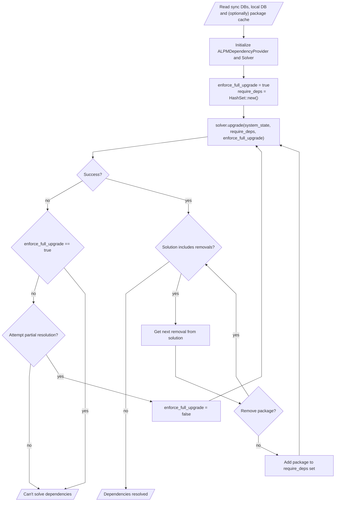

# alpm-solve

A crate for solving package dependencies on an **A**rch **L**inux **P**ackage **M**anagement (ALPM) based systems.

## Documentation

- <https://alpm.archlinux.page/rustdoc/alpm_solve/> for development version of the crate
- <https://docs.rs/alpm-solve/latest/alpm_solve/> for released versions of the crate

## Usage

In order to perform dependency resolution, first we have to feed relevant data into the `ALPMDependencyProvider`:

```rust
use alpm_solve::ALPMDependencyProvider;
use alpm_types::RepositoryName;
# fn main() -> testresult::TestResult {
# let core: Vec<alpm_db::desc::DbDescFile> = vec![];
# let extra: Vec<alpm_db::desc::DbDescFile> = vec![];
# let system_state: Vec<alpm_db::desc::DbDescFile> = vec![];
# let cache: Vec<alpm_db::desc::DbDescFile> = vec![];
    
// The provider is initialized with a list of package names (any type implementing `alpm_types::Named`).
// The solver will try to keep names on this list installed and only uninstall them in case of conflict.
let mut provider = ALPMDependencyProvider::new(&system_state);
    
// Optionally a flag enforcing optional dependencies can be set.
// This will cause the solver to require all already installed optional dependencies
// To meet the version requirements of their reverse dependencies.
// Defaults to `false`, which means that the resulting solution can cause previously
// satisfied optional dependencies to not be satisfied anymore.
// This is a behavior consistent with `pacman`
provider = provider.with_optdepends_enforced(true);

// Feed sync DBs data into the provider.
// This will be used as a set of available packages for dependency resolution.
// In case of two repositories providing the same package in the same version,
// the one with a higher priority (second argument) takes precedence.
provider.add_package_repository(RepositoryName::new("core")?, 0, core);
provider.add_package_repository(RepositoryName::new("extra")?, -1, extra);
    
// It is also possible to make the provider aware of package cache.
// This is more helpful in case of downgrades, 
// but may be also useful when performing partial system upgrade after a downgrade.
// Package cache has a priority of `50`, any sync DB data added with priority above `50`
// will take precedence over the cache, which can result in the solution requesting to re-download
// packages already in the cache.
provider.add_package_cache(cache);
    
// Additionally it is recommended to add already installed packages (local DB data).
// This way, the solver won't request downloading versions of packages that are already installed.
// Installed packages must be added AFTER feeding the provider with sync DB and package cache data.
// Installed packages have the highest priority of `i8::MAX`;
provider.add_installed(system_state.clone());
# Ok(())
# }
```

After adding all required data into the dependency provider, we can initialize the `Solver`:

```rust
use alpm_solve::Solver;
# use alpm_solve::ALPMDependencyProvider;
# fn main() -> testresult::TestResult {
# let system_state: Vec<alpm_db::desc::DbDescFile> = vec![];
# let mut provider = ALPMDependencyProvider::new(&system_state);
    
let mut solver: Solver = provider.into();
# Ok(())
# }
```

`Solver` can be used multiple times to e.g. compute different problems, or changed requirements based on user input.

### Solving upgrades

```rust
use std::collections::HashSet;
use alpm_solve::{ALPMDependencyProvider, Solver};
# fn main() -> testresult::TestResult {
# let system_state: Vec<alpm_db::desc::DbDescFile> = vec![];
let mut provider = ALPMDependencyProvider::new(&system_state);

// [..] feed data into the solver...

let mut solver: Solver = provider.into();

// Perform dependency resolution.
// Second argument is a set of package names (a subset of system_state) that has to be
// a part of the solution explicitly - this can be used to inform the solver that user did not agree
// to remove a dependency due to a conflict.
// The last argument controls full upgrade enforcement and should be set to `true` for a behavior consistent
// with `pacman -Su`.
// Setting it to `false` will allow partial upgrades.
let solution = solver.upgrade(system_state, HashSet::new(), true)?;
# Ok(())
# }
```

#### Partial upgrades

`Solver` allows partial upgrades, which means that if the solver can't upgrade all packages to the versions in the sync DBs, instead of failing, it will try to upgrade the highest number of packages possible that will not result in unmet or conflicting dependencies.

This means that partial upgrades are infallible as long as:

1. The current system state is valid.
1. Information about installed packages was fed into the `ALPMDependencyProvider`.

This behavior is controlled by the last argument of `Solver::upgrade` (`false` enables partial upgrades).

#### Recommended architecture for package manager implementations

A typical high-level interactive solving loop using `alpm-solve` can be based on the following flowchart:



The partial upgrade path can be skipped for implementations that are meant to be consistent with `pacman -Su`.

#### Limitations

Currently, the solver will never suggest to remove packages that were explicitly installed (not as dependency),
such conflict will always result in a failed resolution.

### Solving downgrades

The `Solver` can be used to resolve downgrading a set of packages using package cache and/or archive repository.

```rust
use std::collections::HashSet;
use alpm_solve::{ALPMDependencyProvider, Solver};
# fn main() -> testresult::TestResult {
# let system_state: Vec<alpm_db::desc::DbDescFile> = vec![];
# let downgrade_set: Vec<alpm_db::desc::DbDescFile> = vec![];
let mut provider = ALPMDependencyProvider::new(&system_state);

// [..] feed data into the solver...

let mut solver: Solver = provider.into();

// Perform dependency resolution.
// The solver will try to downgrade all packages in the downgrade_set while keeping remaining packages on the system
// with the currently installed version.
let solution = solver.downgrade(system_state, downgrade_set)?;
# Ok(())
# }
```

#### Limitations

Currently, the solver will only succeed if it is possible to downgrade the system without any modifications to the packages that are not part of the `downgrade_set` and will not suggest any alternative options.

## Contributing

Please refer to the [contribution guidelines] to learn how to contribute to this project.

## License

This project can be used under the terms of the [Apache-2.0] or [MIT].
Contributions to this project, unless noted otherwise, are automatically licensed under the terms of both of those licenses.

[contribution guidelines]: ../CONTRIBUTING.md
[Apache-2.0]: ../LICENSES/Apache-2.0.txt
[MIT]: ../LICENSES/MIT.txt
